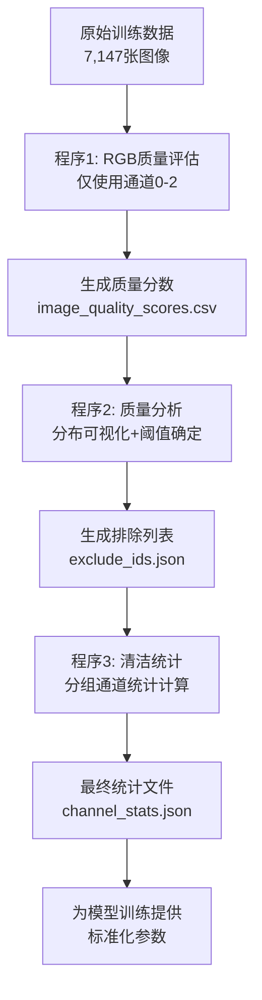

我来详细解释这三个重构后的RGB-based质量评估程序，并先修复代码中的错误。

现在让我详细解释这三个重构后的RGB-based质量评估程序的功能和逻辑：

## 📋 Phase 1 程序详细解释

### 🔍 **程序1: `step2_data_quality_assessment_01.py` - RGB质量评估**

#### **核心功能**

这个程序负责**评估每张训练图像的质量**，但与原版不同，**仅使用RGB光学通道（0-2）**进行评估。

#### **主要改进**

```python
# 原版：使用所有12个通道
for channel in range(image_data.shape[2]):  # 0-11所有通道
    std_val = np.std(channel_data)
avg_std = np.mean(channel_stds)  # 混合不同物理意义的数据

# 重构版：仅使用RGB通道
self.rgb_channels = [0, 1, 2]  # 仅Red, Green, Blue
rgb_data = image_data[:, :, self.rgb_channels]
```

#### **质量指标计算**

程序为每张图像计算**6个质量指标**：

1. **`rgb_std_red`**: 红色通道标准差
2. **`rgb_std_green`**: 绿色通道标准差
3. **`rgb_std_blue`**: 蓝色通道标准差
4. **`rgb_std_mean`**: RGB三通道标准差的平均值（主要评估指标）
5. **`rgb_contrast`**: 灰度图像对比度（使用标准RGB权重：0.299R + 0.587G + 0.114B）
6. **`rgb_brightness`**: 灰度图像平均亮度

#### **输出结果**

- **文件**: `dataset/data_check/image_quality_scores.csv`
- **内容**: 7,147张图像的RGB质量分数
- **排序**: 按 `rgb_std_mean`降序排列（高质量图像在前）

---

### 📊 **程序2: `step2_analyze_quality_02.py` - RGB质量分析与阈值确定**

#### **核心功能**

分析RGB质量分数的分布特征，确定低质量图像的排除阈值，生成排除列表。

#### **分析内容**

**1. 统计分析**

```python
# RGB均值标准差统计
mean: 316.30, median: 166.54, min: 10.65, max: 4849.24

# 各通道独立统计
Red   - Mean: 290.64, Median: 131.99
Green - Mean: 311.64, Median: 172.83  
Blue  - Mean: 346.60, Median: 194.37
```

**2. 可视化分析（3×3图表）**

- RGB均值标准差分布图
- 按类别的RGB质量箱线图
- RGB对比度分布图
- 红/绿/蓝各通道分布图
- 累积分布函数
- 低端25%质量分数分析
- 不同阈值的影响分析

**3. 阈值确定策略**

```python
threshold_options = {
    'Conservative (5th percentile)': 41.87,  # 排除143张图像 (5%)
    'Moderate (10th percentile)': 48.99,     # 排除358张图像 (10%) ✓推荐
    'Aggressive (15th percentile)': 63.02   # 排除715张图像 (15%)
}
```

#### **重要发现**

- **所有358张被排除的低质量图像都来自类别0（非滑坡）**
- **类别1（滑坡）图像质量普遍较高**，说明滑坡事件通常具有更明显的光学特征

#### **输出结果**

- **`quality_score_distribution.png`**: 9张子图的综合可视化分析
- **`exclude_ids.json`**: 包含排除列表和元数据的JSON文件

---

### 📈 **程序3: `step2_calculate_clean_stats_03.py` - 清洁数据集统计**

#### **核心功能**

基于RGB质量过滤的结果，计算清洁数据集的**分组通道统计**，为模型训练提供标准化参数。

#### **创新设计：通道分组**

```python
self.channel_groups = {
    'optical': [0, 1, 2, 3],           # Sentinel-2光学数据
    'sar_descending': [4, 5],          # SAR下行数据
    'sar_desc_diff': [6, 7],           # SAR下行差分
    'sar_ascending': [8, 9],           # SAR上行数据  
    'sar_asc_diff': [10, 11]           # SAR上行差分
}
```

#### **统计计算**

为每个通道组的每个通道计算：

- **基本统计**: mean, std, min, max, median
- **分位数**: Q25, Q75
- **像素计数**: 参与统计的像素总数

#### **数据流程**

1. **加载排除列表**: 读取358个低质量图像ID
2. **过滤数据**: 6,789张清洁图像（95%保留率）
3. **分组处理**: 按通道类型分别计算统计
4. **结果整合**: 生成包含所有元数据的JSON文件

#### **输出文件结构**

```json
{
  "dataset_info": {
    "filtering_approach": "RGB_optical_channels_only",
    "exclusion_method": "rgb_optical_channels_only_5th_percentile",
    "retention_rate": 0.95
  },
  "channel_statistics_by_group": {
    "optical": { /* Sentinel-2统计 */ },
    "sar_descending": { /* SAR下行统计 */ },
    // ... 其他组
  },
  "quality_assessment_info": {
    "rgb_channels_used": [0, 1, 2],
    "sar_channels_excluded_from_quality": [4, 5, 6, 7, 8, 9, 10, 11]
  }
}
```

---

## 🎯 **三程序协作逻辑**



## ✨ **重构的核心价值**

1. **科学性**: 避免将物理意义不同的数据混合评估
2. **可靠性**: SAR噪声不再干扰光学质量判断
3. **完整性**: 保留所有数据用于训练，仅质量评估使用RGB
4. **可解释性**: 分组统计使结果更易理解和使用
5. **可追溯性**: 完整记录过滤方法和参数

这种重构确保了**质量评估的科学性**，同时**保持了数据的完整性**，为后续的多模态模型训练奠定了坚实基础。
